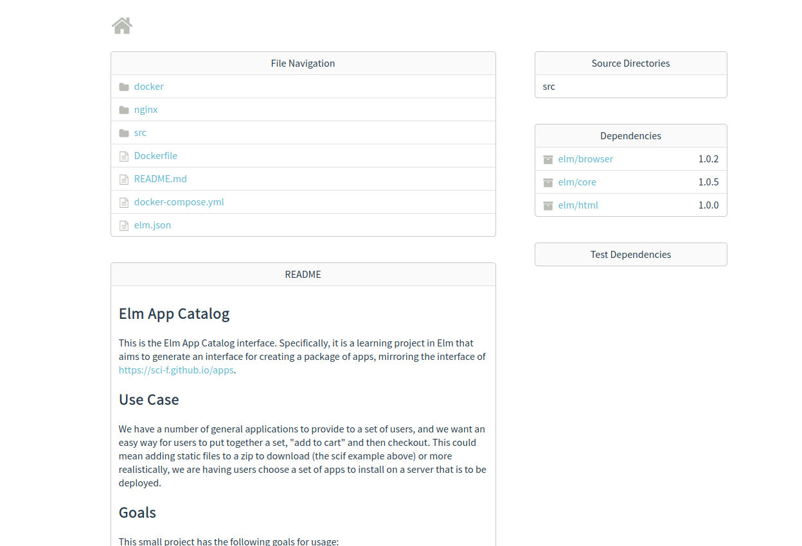
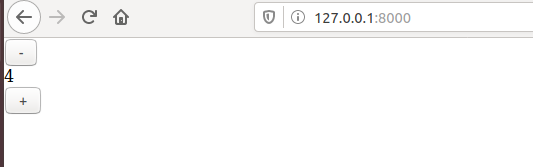

# Elm App Catalog

This is the Elm App Catalog interface. Specifically, it is a learning project in
Elm that aims to generate an interface for creating a package of apps, mirroring
the interface of [https://sci-f.github.io/apps](https://sci-f.github.io/apps). 

## Use Case

We have a number of general applications to provide to a set of users, and we want
an easy way for users to put together a set, "add to cart" and then checkout.
This could mean adding static files to a zip to download (the scif example above)
or more realistically, we are having users choose a set of apps to install on
a server that is to be deployed.

## Goals

This small project has the following goals for usage:

1. Being able to build a UI which interrogates an API of a catalogue
2. Allows the user to search/browse by name, description & tags
3. Let them build up a ‘shopping cart’ of applications 
4. Let them edit the ‘cart’ (change sort order & remove items)
5. Render the current list of chosen applications as formatted text in a template of some sort (Singularity recipe to build container)

and the following goals for development and learning:

1. Familiarize with Elm (a functional language)
2. Provide an example of a Dockerized working environment with dependencies for building interface

Once the above works, it should be possible to change the set of appications to install
to one that is general for a server, and perhaps using cloud init.


## Development

These sections will walk through how I went about development.

### Docker

I wanted to start off the bat using Docker, so I wrote a [Dockerfile](Dockerfile)
as a base container to install elm with node 10 (I am very averse to installing this
directly on my host). I also added an nginx web server, although I won't need it for
some time. I added a [docker-compose.yml](docker-compose.yml) to build
both containers, and then could bulid them:

```bash
docker-compose build
```

and bring them up:

```bash
$ docker-compose ps
         Name                      Command             State         Ports       
---------------------------------------------------------------------------------
elm-app-catalog_elm_1     /code/docker/entrypoint.sh   Up      8080/tcp          
elm-app-catalog_nginx_1   nginx -g daemon off;         Up      0.0.0.0:80->80/tcp
```

The current [entrypoint.sh](docker/entrypoint.sh) is pretty silly, it tails
to /dev/null just to keep the container running. We can now shell interactively
into the elm-app-catalog_elm container to interact with elm:

```bash
$ docker exec -it elm-app-catalog_elm_1 bash
root@be1e8bc80748:/code# elm
Hi, thank you for trying out Elm 0.19.1. I hope you like it!
...
```

Since I bound the present working directory to /code in the container, I 
can make changes there and they show up here. There might be permissions
issues with files since I'm creating them in the container, 
but I'll deal with that later with a `chown -R $USER .`.

```bash
root@be1e8bc80748:/code# ls
Dockerfile  README.md  docker  docker-compose.yml  nginx
root@be1e8bc80748:/code# elm init
Hello! Elm projects always start with an elm.json file. I can create them!

Now you may be wondering, what will be in this file? How do I add Elm files to
my project? How do I see it in the browser? How will my code grow? Do I need
more directories? What about tests? Etc.

Check out <https://elm-lang.org/0.19.1/init> for all the answers!

Knowing all that, would you like me to create an elm.json file now? [Y/n]: y
Okay, I created it. Now read that link!
```

This seems to have created an elm.json file and an empty directory called src:

```bash
root@be1e8bc80748:/code# cat elm.json  
{
    "type": "application",
    "source-directories": [
        "src"
    ],
    "elm-version": "0.19.1",
    "dependencies": {
        "direct": {
            "elm/browser": "1.0.2",
            "elm/core": "1.0.5",
            "elm/html": "1.0.0"
        },
        "indirect": {
            "elm/json": "1.1.3",
            "elm/time": "1.0.0",
            "elm/url": "1.0.0",
            "elm/virtual-dom": "1.0.2"
        }
    },
    "test-dependencies": {
        "direct": {},
        "indirect": {}
    }
}
```

I can now run `elm reactor` to start a development server. Since I've mapped
port 8000 to 8000 on my host, I can see it at [127.0.0.1:8000](http://127.0.0.1:8000).

```bash
root@be1e8bc80748:/code# elm reactor
Go to http://localhost:8000 to see your project dashboard.
```



It's really quite pretty! If this reactor is useful for updating an interface, I could
make it the entrypoing to the container. But I'm not sure that's what I want to do yet.


### Elm Interpreter

I first wanted to play around and test some of the [core language](https://guide.elm-lang.org/core_language.html).
I shelled into the container, and found the right command to execute to the binary,
which turned out to be:

```bash
docker exec -it elm-app-catalog_elm_1 bash
elm repl

# Test things!

:exit
```

### Writing Code

I am starting with the [incrementer](https://guide.elm-lang.org/architecture/buttons.html)
example. I remember seeing it somewhere (but I cannot find now) but the main file
should be called [src/Main.elm](src/Main.elm). I also realized at this point
that my editor (gedit) didn't have a plugin to render elm files, so I made one
[here](https://github.com/vsoch/elm-editors). Then I was able to open the file
in my editor, and from inside the container, try compiling it:

```bash
docker exec -it elm-app-catalog_elm_1 bash
elm make src/Main.elm
```

I first got an error about a missing module definition at the top, but then
I was able to generate an index.html file, and run a local webserver using
Python (2.7!) in the container.

```bash
# elm make src/Main.elm
Success! Compiled 1 module.

    Main ───> index.html

# python -m SimpleHTTPServer 8000
```

Then I could open my browser to see the very simple counter:



You can imagine that you might also want to pull some changes from
a branch (for PR or other) on your host, and then shell into the
container and regenerate the index.html.

#### UI Widgets

My next instruction was to replace the Elm html widgets with [ui-widgets](https://github.com/mdgriffith/elm-ui).
After some poking around, I tried shelling into the container and trying this:

```bash
$ docker exec -it elm-app-catalog_elm_1 bash
root@6913ee3163a0:/code# elm install mdgriffith/elm-ui
Here is my plan:
  
  Add:
    mdgriffith/elm-ui    1.1.5

Would you like me to update your elm.json accordingly? [Y/n]: y
```

Hey that seemed to work! Here is the updated [elm.json](elm.json):

```json
# cat elm.json 
{
    "type": "application",
    "source-directories": [
        "src"
    ],
    "elm-version": "0.19.1",
    "dependencies": {
        "direct": {
            "elm/browser": "1.0.2",
            "elm/core": "1.0.5",
            "elm/html": "1.0.0",
            "mdgriffith/elm-ui": "1.1.5"
        },
        "indirect": {
            "elm/json": "1.1.3",
            "elm/time": "1.0.0",
            "elm/url": "1.0.0",
            "elm/virtual-dom": "1.0.2"
        }
    },
    "test-dependencies": {
        "direct": {},
        "indirect": {}
    }
}
```

And now we would want to try importing the types into our Main.elm.
Per code as example help from [here](https://github.com/vsoch/elm-app-catalog/pull/1/files)
I was directed to look at [documentation](https://package.elm-lang.org/packages/mdgriffith/elm-ui/latest/Element) to familiarize myself with the Element namespace. This is 
akin to looking up functions and usage for any module. Things that I experimented
with include:

 - changing a variable named "Model" to "Counter" because it represents an integer for the counter number, and I didn't think "model" described that accurately.
 - changed name "Msg" to "Action" so it better describes the variable.
 - testing changing the smaller variable name (model -> counter) to be something other than the lowercase version of the type to ensure that this is okay to do.

##### Replace Html.button with Elm.Input.button

The next goal is to replace increment and decrement buttons 
(currently type Html.button) with Elm UI buttons (Element.Input.button).
Since we've already imported Element, I can likely reference Element.Input.button.
I found documentation for [Element.Input](https://package.elm-lang.org/packages/mdgriffith/elm-ui/latest/Element-Input) and then there was already a hint in the PR code for
how to do this:

```elm
(Element.Input.button []
    { onPress = Just Reset
     , label = Element.text "Reset"
    }
)
```

I'm not totally clear on what "Just" is but it seems to be related to [typing](https://medium.com/wat-the-elm-ist/maybe-its-just-nothing-ffa85785fa85) so I'm going to copy the
convention and use it for now. This should be fairly easy then, I just need to replace

```elm
[ button [ onClick Decrement ] [ text "-" ]
```

with something like the above for each button type. That looked like this:

```elm
view : Counter -> Html Action
view counter =
    div []
        [ Element.layout []
            (Element.Input.button []
              { onPress = Just Decrement
              , label = Element.text "-"
              }
            )
        , div [] [ text (String.fromInt counter) ]
        , Element.layout []
            (Element.Input.button []
              { onPress = Just Increment
              , label = Element.text "+"
              }
            )
        , Element.layout []
            (Element.Input.button []
                { onPress = Just Reset
                , label = Element.text "Reset"
                }
            )
        ]
```

And that seemed to work! However the buttons are now unstyled. Let's see
if we can apply some quick fixes to make them prettier (or at least give them
more structure). I figured out how to define colors and use them, e.g., here is
definition:

```elm
marigold =
    Element.rgb255 252 186 3

green =
    Element.rgb255 8 196 27
```

And you can see usage in the [src/Main.elm](src/Main.elm). I haven't figured out
how to apply other styling yet.

### Fixing Permissions

When I'm done developing inside the container, it's fairly straight forward
to exit and make sure that my user owns all the root generated files.

```bash
sudo chown -R $USER .
```

In the future when you don't need to make new files from *inside* the container,
as long as you save them from the outside and then restart the container
if changes need to take effect, you shouldn't run into permissions errors (root
is not saving the file).

### Removing Bind

When you want to build a "production" container not bound to the host, simply
remove the `volumes` section in the [docker-compose.yml](docker-compose.yml).
